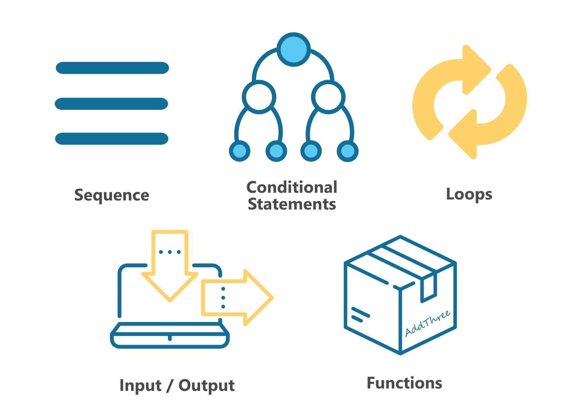

******************
Control Structures
******************

The first program in Getting Started section consisted of sequential execution of tasks. However, the vast majority of times you will need a more complex structure 
for your code - whether it is control over which statements get executed or how many times they get executed. This is when control structures introduced in this section
- such as loops or conditional statements - come in handy. 

Conditional statements
======================

First example of a use case of control structures arises when you want to execute a part of your code only if a certain condition is satisfied. 
For example, if you want to trigger an event only if a button is pressed: ::

	from microbit import *
	import love
		
	while True:
		if button_a.is_pressed():
			love.badaboom()
													
		elif button_b.is_pressed():
			display.show(Image.HAPPY)
													
		else:
			display.show(Image.GHOST)

	sleep(100)

In case you want to execute a different task under several different conditions, use ``elif`` (short for ``else if``) statement. ``else`` statement comes in useful if you want to do something
in the rest of the cases, where no condition is defined. The latter two statements are only usable if you had used an ``if`` statement previously, but neither is mandatory.

Loops
=====

Loops are a very useful structure in case you want to repeat a certain block of code several times over.
There are two types of loops: ``for`` loops, that keep count of the number of times a block of code is executed, and ``while`` loops which
perform an action until a condition you've specified is no longer true. 

For loops
---------
There are times when you want to do an action a specific number of times, or you need to keep track of how many times it was performed. For example you'd like 
to turn on the LEDs on the uppermost horizontal and rightmost vertical side. You can use a ``for`` loop to change which LED lights up like this::

	from microbit import *

	for i in range (5):
	   # set the pixel in column 0, row i to 9 
	   display.set_pixel(0, i, 9) 

	   # set the pixel in column 4, row i to 9	
	   display.set_pixel(4, i, 9)	 

Here is another example.  You could use a ``for loop`` to turn on all the LEDs in sequence, one at a time::

    from microbit import *

    display.clear()
    for x in range(0, 5):
        for y in range(0, 5):
            display.set_pixel(x, y, 9)  

The ``for loop`` lets you execute a loop a specific number of times using a counter. The outer loop::

        for x in range(0,5):

will execute the loop five times substituting ``x`` for consecutive values in the range ``0`` to ``4`` each time (in Python and most programming languages, 
we always start counting from ``0``). The loop will stop before it reaches 5, the final value in the range.

The inner loop::

        for y in range(0,5):

will execute the loop five times substituting ``y`` for consecutive values in the range ``0`` to ``4`` each time. Again, the loop will stop before it reaches the final value in the range.

While loops
-----------
One of the most common things you might want to do with a ``while`` loop is to do something forever, that is until the micro:bit
is turned off or reset. Maybe you have programmed your micro:bit with a game or perhaps it is collecting 
temperature data. Here is an example of some code to repeat forever::

	from microbit import *
	
	while True:
	    display.scroll("Hello UCL)

This code will repeatedly display the message ``Hello UCL``. You will likely have at least one ``while True:`` loop in your program
to keep the micro:bit going.

But what if you want to do an action only whilst something is happening? Perhaps you would like to display an image
if the temperature on the micro:bit goes below a certain value so you'll need to test the temperature::

	from microbit import *
	
	while (temperature() < 18):
	    display.scroll(Image.SAD)
	    sleep(1000)

	display.show(Image.HAPPY)

Practice Questions
===================

1. Display a different image depending on which side microbit is tilted in.

2. Program an LED 'sprite' that moves in the direction micro:bit is tilted in.

3. Program an LED sprite to run in a circle. Try to extend it to a snake by adding a tail of LEDs to the original sprite.

4. Do the same as in previous question, but this time make the sprite stop when a button is being pressed and restart if it's pressed again.