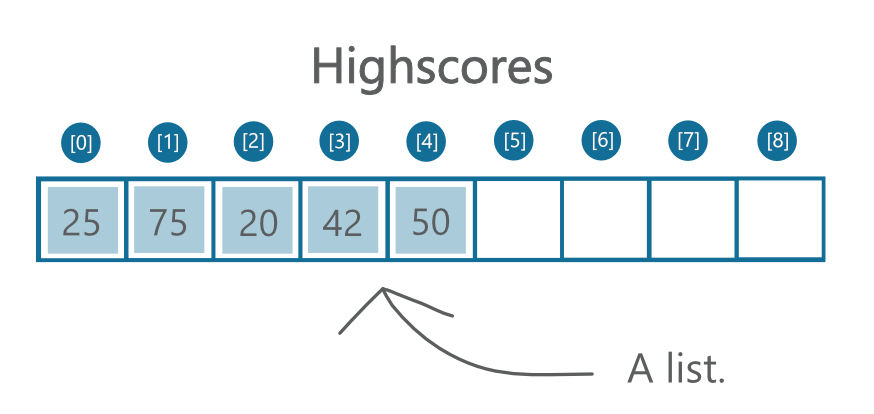
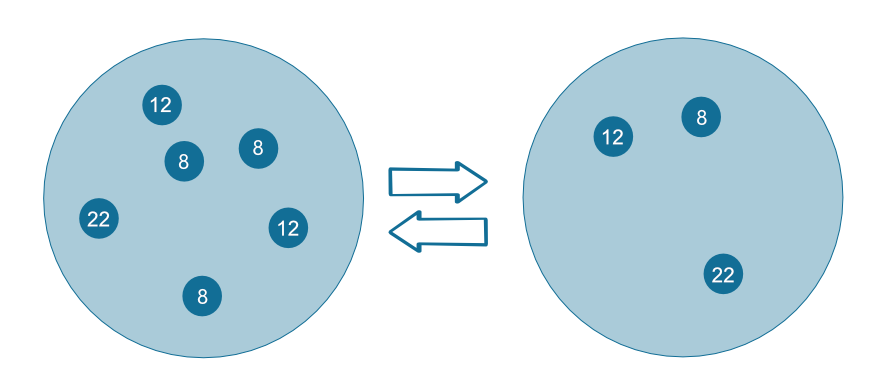

****************
Data Structures
****************

Lists
======

List is a data structure used to store any data type (or structure) in an ordered manner. It's a data structure that you'll probably use most often. Let's say we want to 
store a player's scores. We could use a list like the  one pictured above. The list has one "box" for each value. The pieces of data stored in a list are called `elements`. 

     
	 A list.

To create a list, you specify its contents enclosed within brackets and delimited by commas: :: 

	from microbit import *

	high_scores = [25, 20, 10, 15, 30]       # Create a list and store some values in it.
	print(high_scores[0])			# Print 25
	print(high_scores[3])			# Print 15

Finding the value of one of the elements in a list is straightforward as long as you keep in mind that Python counts the elements from '0'. In the ``high_scores`` list 
above, ``high_scores[0]`` is 25 and ``high_scores[3]`` is 15.

Here you can also see that particular elements in a list can be accessed by their index. Furthermore, it is possible to slice lists to get only a part of a list depending
on the index. If you only want the first three, you can write ``high_scores[0:3]``, or, since we are starting at 0, we can shorten it to ``high_scores[:3]``. Mind that
the right endpoint is alway excluded, so the 'slice' above refers to the mathematical interval ``[0,2]``.

Not surprisingly, Python has features for working with lists. The code snippet below calculates the sum of all elements and then calculates the average high score. ::		

	total_score = 0
	
	for score in high_scores: 		# For each element ...
		total_score = total_score + score

	average = total_score / len(high_scores)  # Use the len() function here to find the length of the array 

The same can be done in one line using the ``sum`` function::

	average_quick = sum(high_score) / len(high_score)	 

Since you don't necessarily know what values in the list are going to be, or how large the list will be, it's useful to know the ``append`` function. 
For example, you can use it to fill a list with temperature readings or accelerometer values:: 

	from microbit import *

	recorded_temperature = [] 		# Create an empty list
	for i in range(100):			# Add 100 temperature values
		recorded_temperature.append(temperature())
		sleep(1000)			 

The ``for`` loop is executed 100 times and ``i`` will have values from 0 to 99. This will measure the temperature every second for 100 seconds and append the value 
to the end of the list. 

Deleting items from a list is just as straightforward::

	high_scores.delete(24)

This will delete the first element with the value 24.
Alternatively, you might want to delete an element at a specific position, if you know it:: 
 
	high_scores.pop(3)

This will delete or 'pop' the element at the given position in the list. Note that::

	high_scores.pop() 

will delete the last element in the list.

.. tip:: You can look here_ to see more useful methods on lists.

.. _here: https://docs.python.org/2/tutorial/datastructures.html#tuples-and-sequences

.. note:: You might be wondering whether strings can be considered to be a list. Even though string is an array of characters and we can even do similar operations on 
	them (like slicing), they are both different types of objects with different methods (try to type ``dir(str)`` and ``dir(list)`` in your console). 

Sorting
^^^^^^^

Often you'll find the need to have data in your list sorted, for example when implementing search algorithms. In Python, sorting lists is easy using the 
``sort(key=, reverse=)`` method::

	high_scores = [25, 20, 10, 15, 30]
	high_scores.sort()

You don't only have to sort numbers - its optional key parameter allows you to specify your own	function for comparing elements in your list (for example, while 
sorting a list of strings according to length, you can pass the len() function as the parameter). Passing false to reverse parameter allows you to sort in a descending 
order. ::

	list = ['longest', 'short', 'longer']

	# Sort list in ascending order of string length
	list.sort(key=len)
	# Sort list in descending order of string length
	list.sort(key=len, reverse=True)

Tuples
=======

Tuples are similar to lists in that they are used to store an ordered sequence of items, usually of varying datatype.::

    high_scores_immutable = (25, 20, 10, 15, 30)

You can retrieve values in the same way as with lists, but the most important difference is that tuples are `immutable`. This means, that in the ``high_scores`` 
list above, you can change the value of individual elements: ::

    high_scores[0] = 42

However, trying to change a value inside ``high_scores_immutable`` will return a ``TypeError: Object tuple does not support item assignment``. Once you assign values 
inside a tuple, they cannot be changed. 

Mutability is another difference between strings and lists - while lists are mutable, string are not.

Sets
=====

Unlike lists and tuples, sets hold an **unordered** collection of elements with no duplicates. This makes them suitable for testing membership or removing 
duplicate elements. ::

	set = {8, 12, 22}

	# Add a single element to set
	set.add(42)

	# Add several elements to set
	set.update([16, 32, 64])

	# Remove an element from set - throws an error if element not in set 
	set.remove(42)

	# Remove an element if present in set 
	set.discard(42)

	 

Since a set is an unordered collection of elements, indexing is not possible. Python supports typical set operation methods: ::

	set_a = {1,2,3,4,5}
	set_b = {4,5,6,7}
	set_c = {1,2}

	# Check for membership
	2 in set_a

	# Return elements in the intersection of set_a and set_b
	set_a.intersection(set_b)
	# Return true if set_a contains all the elements of set_c
	set_a.issuperset(set_c)

An empty set is created using a ``set()`` method, as using braces creates an empty dictionary (see below).  	

For more methods, visit Python documentation_.

.. _documentation: https://docs.python.org/2/library/stdtypes.html#set

   All elements within a set are unique

Dictionaries
=============

Dictionary is an unordered set of ``key : value`` pairs. It's a rule that all keys are unique and have no duplicates. Unlike lists or tuples, which are indexed by numbers, 
you can retrieve a value from a dictionary by using the key as an index.

For example, you can store the highscores of all the players: ::

	game_register = { 'googolplex': 100,
			  'terminat0r': 27,
			  'r00t': 150,
			  'dent': 42,
			  'teapot418' : 0 } 

	# Access elements
	game_register['dent']

	# Add or update and existing entry
	game_register['pepper'] = 50

	# Delete an entry
	del game_register['pepper']	

	# Delete all entries
	game_register.clear()

	# Delete the dictionary
	del game_register

	# Retrieve a value for the key or default if not in dicionary
	game_register.get('dent')		

Practice Questions
===================

1. Use micro:bit list Image.ALL_CLOCKS and iterate over all items in the list with a for loop, showing them on the LED screen.

2. Using the same item list, show only items with an index divisible by 3.

3. Sort an integer list (for example ``list = [20, 112, 45, 80, 23]``) using the last digit of each item and keep their relative positions in case the digit is the same
   (the result in this case would be ``[20, 80, 112, 23, 45]``).

4. Create an animation of your own using a tuple and play it on the micro:bit LED screen.

5. Program microbit to take a compass reading upon press of a button and store the results in a tuple.

6. Write a program to keep record of gestures recognizable by microbit and the number of times they've been detected using a dictionary. 