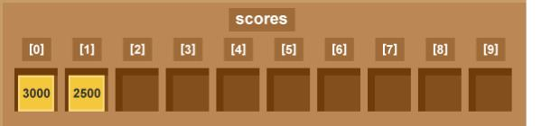

****************
Data Structures
****************

Lists
======

 
   Image from <http://www.bbc.co.uk/education/guides/zy9thyc/revision>

Lists are a datastructures used to store any data type (or structure) in an ordered manner. Let's say we want to store a player's scores, we could use a list like the 
one pictured above. The list has one box for each value. The data stored in a list are called `elements`. 

Let's see how to use a list in Python. To create a list we can tell Python the name  of the list and what it will contain:: 

	from microbit import *

	high_scores = [25, 20, 10, 15, 30]       # Create a list and store some values in it.
	print(high_scores[0])			# Print 25
	print(high_scores[3])			# Print 15

Finding the value of one of the elements in a list is easy as long as you remember that Python counts the elements from '0'. In our ``high_scores`` list above, 
``high_scores[0]`` is 25 and ``high_scores[3]`` is 15.

Here you can also see that particular elements in a list cna be accessed by indexing. Furthermore, it is possible to slice lists to get only a part of a list depending
on the index. If you only want the first three, you can write ``high_scores[0:3]``, or, since we are starting at 0, we can shorten it to ``high_scores[:3]``. Mind that
the right endpoint is alway excluded, so the 'slice' above refers to the mathematical interval ``[0:2]``.

Not surprisingly, Python has some features to help us do things with lists. The code snippet below will go through the array elements one by one so that we can sum them 
and calculate the average high score::

	print("Average High Score: ") 		

	total_score = 0
	for score in high_scores: 		# For each element ...
		total_score = total_score + score

	average = total_score / len(high_scores)  # Use the len() function here to find the length of the array 
	print(average)  

Since you don't necessarily know what values in the list are going to be, or how large the list will be, it's useful to use the ``append`` function. 
In this way you can for example fill a list with temperature readings or accelerometer values:: 

	from microbit import *

	recorded_temperature = [] 		# Create an empty list
	for i in range(100):			# Add 100 temperature values
		recorded_temperature.append(temperature())
		sleep(1000)			 

The ``for`` loop is executed 100 times and ``i`` will have values from 0 to 99. This will measure the temperature every second for 100 seconds and append the value on to the end of the list. 

Deleting items from a list is just as straightforward::

	high_scores.delete(24)

This will delete the first element with the value 24.
Alternatively, you might want to delete an element at a specific position, if you know it:: 
 
	high_scores.pop(3)

This will delete or 'pop' the element at the given position in the list. Note that::

	high_scores.pop() 

will delete the last element in the list.

.. seealso:: You can look here_ to see more useful native functions on lists.

.. _here: https://docs.python.org/2/tutorial/datastructures.html#tuples-and-sequences

.. note:: You might be thinking, whether string is a list. Even though string is an array of characters and we can even do similar operations on them (like slicing), they are both different structures with different methods (try to type ``dir(str)`` and ``dir(list)`` in your console). 

Tuples
=======

Tuples are similar to lists in that the are used to store an ordered sequence of items.::

    high_scores_immutable = 25, 20, 10, 15, 30

You can retrieve values in the same way as in lists, but the most important difference is, that tuples are `immutable`. This means, that while in the ``high_scores`` list above, you can change the value of infividual elements,::

    high_scores[0] = 42

once you define a tuple, you cannot change the value it stores.  

Sets
=====

Unlike lists and tuples, sets hold an unordered collection of elements with no duplicates. This makes them suitable to use for testing membership or removing 
duplicate elements.

Dictionaries
=============

Dictionary is an unordered set of key:value pairs. It's a rule that all keys are unique and have no duplicates. Unlike lists or tuples, which are indexed by numbers, 
you can retrieve a value by using the key as an index.

For example, you can store the highscores of all the players::

    game_register = { 'googolplex': 100,
                      'terminat0r': 27,
                      'r00t': 150,
                      'dent': 42,
                      'teapot418' : 0 }              
