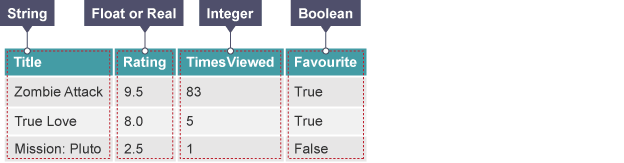

***********
Data Types
***********

In order to accurately capture various types of data, programming languages provide us with different data types to allow us to represent them properly.
Each case, whether it is gathering acceleration values from the accelerometer or counting the number of times a button was pressed, requires a different approach, 
which is why Python and most other programming languages recognise several data types for representing values:

+-----------------+------------------------------------------------------+--------------------+
| **Data Type**   | **Description**                                      | **Example**        |
+=================+======================================================+====================+
| Integers        | Whole numbers                                        | ``42``             |
+-----------------+------------------------------------------------------+--------------------+
| Floats          | Numbers with decimal point, fractions                | ``3.1415``         |
+-----------------+------------------------------------------------------+--------------------+
| Complex numbers | Numbers with both real and an imaginary component    | ``1 + 3j``         |
+-----------------+------------------------------------------------------+--------------------+
| Strings         | Sequences of characters delimited by quotation marks | ``"Hello World!"`` |
+-----------------+------------------------------------------------------+--------------------+
| Booleans        | Values representing true and false values            | ``False``          |
+-----------------+------------------------------------------------------+--------------------+

In a simple program you might use all of these. Here are the data types you could use in a program storing information about your micro:bit game:

     
	 Source: <http://www.bbc.co.uk/education/guides/zwmbgk7/revision/3>

Operations
===========

Numbers
--------
Basic arithmetic operators: ``+,-,*,/`` are used in the same way as you would with a calculator. 
Let's look at an example using arithmetic operators the temperature read by the micro:bit in Celsius to Fahrenheit::

	celsiusTemp = temperature()
	fahrenheitTemp = celsiusTemp * 9 / 5 + 32  

.. warning:: Python recognises two division operators: ``/`` and ``//``. First one outputs the result you'd expect, but the second one does integer division: the 
	return value is actually the floor of the result. This means that the return value is always rounded down.

Operator ``%``, called ``mod`` is used to calculate the remainder when one value is divided by another. For example: maybe you'd like to know whether a number is odd or 
even, you could try dividing it by 2, if it's even, then there will be no remainder::

	number = 3
	if number % 2 == 1:
	   print("The number is odd")
	else:
	   print("The number is even")

If the remainder is equal to ``1`` then this program will print ``The number is odd``, otherwise it will print ``The number is even``. 
You might write this program in a different way. People think about problems in different ways and no two programs are likely to be the same. 

Strings
--------
As stated above, strings (``str`` type in Python) are sequences of characters, with a length limited only by the memory of your machine. A useful fact to note is 
that they can be concatenated using a ``+`` symbol::

	name = "Hayley"

	message = "Well done " + name + ". You are victorious!"

This will concatenate the items on the right hand side of ``=`` and put the result in the variable called ``message``.

To join numbers and strings together, you must first convert the number to a string using the ``str()`` function if you want to do that::

	x = temperature
	if temperature < 6:
	   display.scroll("Cold" + str(temperature))

.. note:: Python natively provides a lot of methods_, which makes using strings much easier and saves lot of time (although implementing them on your own initially 
	might be a good programming exercise). 

.. _methods: https://www.programiz.com/python-programming/methods/string

Booleans
---------
A Boolean value is a value that is either ``True`` or ``False``, also represented by `1` and `0`. In Python, there is a number of operations that 
allow you to manipulate boolean expressions.  

Comparison
^^^^^^^^^^^^

.. figure:: assets/booleanLogic.jpg 
   :scale: 60 %
   :align: center

   Source: <http://www.bbc.co.uk/education/guides/zy9thyc/revision>

Comparison operations are useful to test variable values in conditional statements or loops. Here are some examples of 
comparisons written in English::

	score is greater than 100
	name equals "Harry"
 	x acceleration is not equal to 0

Python has a set of comparison operators that allow us to write comparisons easily:

.. tabularcolumns:: |L|l|

+--------------------------------+----------------------------------------+
| **Comparison Operator**        | **Meaning**                            |
+================================+========================================+
| ==                             | Equal to                               |
+--------------------------------+----------------------------------------+
| <, <=                          | Less than, less than or equal to       |
+--------------------------------+----------------------------------------+
| >, >=                          | Greater than, greater than or equal to |
+--------------------------------+----------------------------------------+
| !=                             | not equal to                           |
+--------------------------------+----------------------------------------+

Rewriting the comparisons above in Python would be::

	score > 100
	name ==  "Harry"
 	acceleration  != 0

Logical operations
^^^^^^^^^^^^^^^^^^^

Logical operators test the truth value of their operands.

+--------------+---------------------------------+-------------------+
| **Operator** |  **Evaluates to ``True`` if:**  | **Example**       |
+==============+=================================+===================+
| and          |  Both operands are true         | ``True and True`` |
+--------------+---------------------------------+-------------------+
| or           |  At least one operand is true   | ``True or False`` |
+--------------+---------------------------------+-------------------+
| not          |  Operand is false               | ``not False``     |
+--------------+---------------------------------+-------------------+
	

Membership operations
^^^^^^^^^^^^^^^^^^^^^^

Membership operators are useful to determine presence of an element in a sequence.

+--------------+----------------------------------------------------------+--------------------------+
| **Operator** | **Evaluates to ``True`` if:**                            | **Example**              | 
+==============+==========================================================+==========================+
|   in         | A variable value is in the specified sequence            | ``x in [1, 2, 3, 4]``    |
+--------------+----------------------------------------------------------+--------------------------+
| not in       | Does not find a variable value in the specified sequence | ``x not in [1, 2, 3, 4]``|
+--------------+----------------------------------------------------+-----+--------------------------+

Using Boolean operations
^^^^^^^^^^^^^^^^^^^^^^^^^

You may have already used some examples that do this. In this example, the micro:bit will 
show an arrow changing in direction according to acceleration:: 

	from microbit import *
	
	while True:
	    x_bearing = accelerometer.get_x()

	    if (x_bearing <= 100) and (x_acceleration >= 50):
		display.show(Image.ARROW_N)

	    elif x_bearing > 100:
	        display.show(Image.ARROW_E) 
	
	    elif  x_bearing < 50:
	        display.show(Image.ARROW_W) 

	    else:
		display.show(Image.ARROW_S)	 

Practice Questions
===================

	1. Predict whether the return value is True or False. If False, explain why. 

		a) "hello" == 'hello'
		b) 10 == 10.0
		c) 5/2 == 5//2
		d) 5 in [x for x in range(0,5)]
		e) 0 == False
		f) 1 == true
		g) 0.1 + 0.2 == 0.3
		
