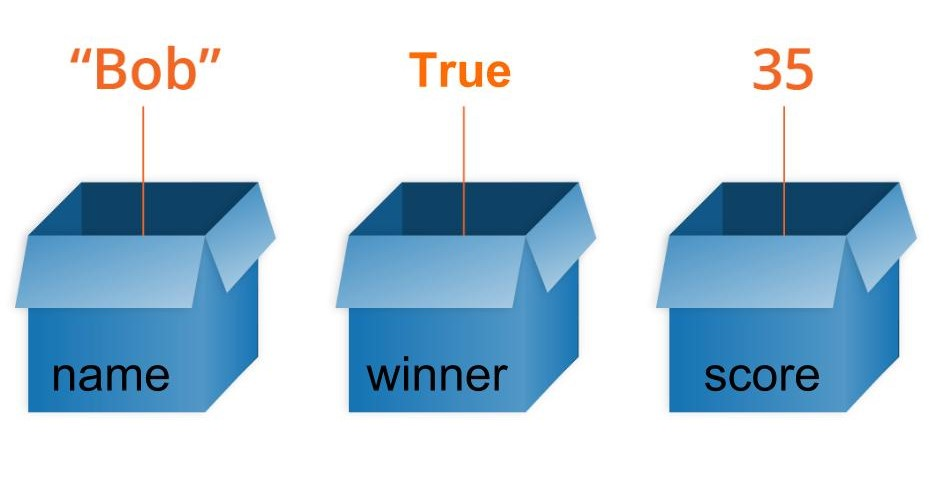

**********
Variables
**********

A variable is a name you give to refer to a memory location where a value is stored. In a more abstract manner it can be thought of as a box that stores a value. 
All variables are made up of three parts: a name, a data type and a value. In the figure below there are three variables of different types:

   Source: <https://developer.mozilla.org/en-US/docs/Learn/JavaScript/First_steps/Variables>

The variable ``name`` contains the string ``Bob``, the variable ``winner`` contains the value ``True`` and the variable ``score`` contains the value ``35``.

In Python a variable is created when it's assigned to for the first time. Once done, variable value can be manipulated (unless it's immutable - you'll learn more about 
this in the ref:`Data Structures` section. ::

	from microbit import *

	myCount = 0

	while True:
    	   if button_a.was_pressed(): 
	   myCount = myCount + 1
	   sleep(2000)
	   print("Number of presses: " + str(myCount))

Here we have used the variable ``myCount`` to count the number of button presses for button ``A``.  Can you tell what else this snippet of code does?
