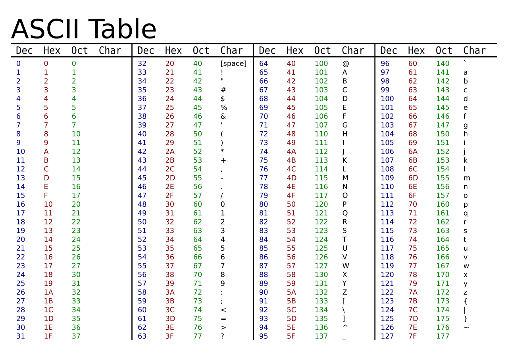

**********************
Caesar Cipher
**********************
	
Description
===========

Humans have been interested in hiding messages for as long as they have been able to communicate by writing things
down. One of the earliest ciphers is known as the Caesar cipher, named after Julius Caesar, and was used by the 
Roman emporer to communicate with troops on the battlefield. Using the Caesar cipher you encrypt all the letters in a message by shifting the alphabet a number of places. The figure below shows how to encrypt a message with a shift of 3 letters:

.. figure:: assets/shift.png
   :align: center

   Source: https://upload.wikimedia.org/wikipedia/commons/f/fa/Ascii-proper-color.svg

Your goal is to turn your micro:bit into a machine that can **encode** messages using the Caesar cipher. We
call the message to be encrypted *plain text* and the encrypted message *cipher text*. 

There is a trick you can use to encrypt, or shift the message. The trick relies on the fact that your
micro:bit sees the letters of the alphabet as numbers. You can translate a letter to a number, and back again using the python functions ``ord()`` and ``chr()``.
                                                                     
Let's say you want to shift each character by 4 places.  Try using this code to turn the character into a 
number and  add 4::

	ascii_char = ord(plaintext_char) + 4      	               
                                                                     
In English this means: translate ``plaintext_char`` into a number using the ``ord()`` function and add 4, the number of characters we want to shift. 

This works because characters in Python are encoded as numbers. One of the most popular (and smallest) systems is ASCII (American Standard Code for Information 
Interchange). However, looking at the table below you can see that it only includes latin and some special characters. This is why Python's (and most languages') native encoding system is
UTF-8, which is also backwards compatible with ASCII. 

But hold on, there is one more thing that we need to do. Since we will only accept uppercase letters A-Z, we need to make sure we only move within its boundaries (since 
adding 4 to Z would land us on '^' in ASCII).

    ascii_char = ord(plaintext_char) + 4    

	if ascii_char > ord('Z')
        ascii_char = ascii_char - 26

	encrypted_char = chr(ascii_char) 

Now try encrypting and then decrypting some messages of your own.  You can try to decrypt the following text. Can you make your program recognize the correct plaintext
on its own?

    S kw k csmu wkx... S kw k gsmuon wkx. Kx exkddbkmdsfo wkx. S drsxu wi vsfob rebdc. Rygofob, S nyx'd uxyg k psq klyed wi csmuxocc, kxn kw xyd cebo grkd sd sc drkd 
    rebdc wo. S kw xyd losxq dbokdon kxn xofob rkfo loox, dryeqr S boczomd wonsmsxo kxn nymdybc. Grkd'c wybo, S kw kvcy cezobcsdsyec sx dro ohdbowo; govv, kd vokcd 
    oxyeqr dy boczomd wonsmsxo. (S'w ceppsmsoxdvi onemkdon xyd dy lo cezobcdsdsyec, led S kw.) Xy, csb, S bopeco dy lo dbokdon yed yp gsmuonxocc. Xyg, iye gsvv mobdksxvi 
    xyd lo cy qyyn kc dy exnobcdkxn drsc. Govv, csb, led S exnobcdkxn sd. S gsvv xyd, yp myebco, lo klvo dy ohzvksx dy iye zbomscovi gry sc qysxq dy ceppob sx drsc mkco 
    pbyw wi gsmuonxocc; S uxyg zobpomdvi govv drkd S gsvv sx xy gki "wemu drsxqc ez" pyb dro nymdybc li bocoxdsxq drosb dbokdwoxd; S uxyg loddob drkx kxiyxo drkd li kvv 
    drsc S kw rkbwsxq yxvi wicovp kxn xy yxo ovco. Led cdsvv, sp S nyx'd qoddbokdon, sd sc yed yp gsmuonxocc. Wi vsfob rebdc; govv, drox vod sd rebd ofox gybco! 
    
        -- P. Nycdyiofcui, Xydoc Pbyw Exnobqbyexn 