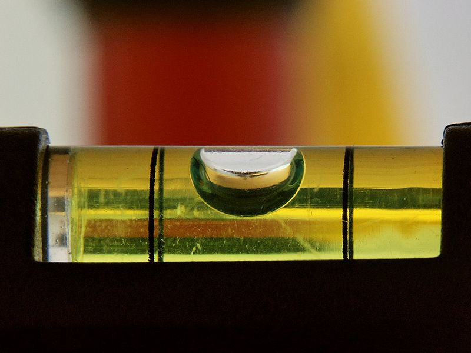

***********
Sprit Level
***********

.. tabularcolumns:: |L|l|

+--------------------------------+----------------------------+
| **Total points possible**	 | **Uses**	              |
+================================+============================+
| 10			 	 | Accelerometer, LED Display |
+--------------------------------+----------------------------+
	
Description
===========
In this project, we will use the accelerometer to make a spirit level.  

   Image source: Wikipedia

A spirit level, like the one in the picture above, is used to tell whether a surface is flat. If you put a spirit level on a flat surface the bubble will rest in the 
middle of the tube. If the surface is tilted to the left or right, the bubble will also move to the left or right indicating visually that there is a slope. You can use accelerometer
values to determine whether the micro:bit is on a flat surface or not and give the user a signal by displaying an arrow, for example, to indicate a tilt. 
                                                                     
Basic Task
===========
Collect points for these stages: 

.. tabularcolumns:: |p{14cm}|R|

+---------------------------------------------------------+------------+
| **Tasks** 		                                  | **Points** |
+=========================================================+============+
| We are going to use the accelerometer values in the x   | 	 2     |
| axis. Write some code to print accelerometer values     |            |
| for the x axis.                                         |            |
+---------------------------------------------------------+------------+
|                                                         |            |
| Write down (on paper) the x axis values for the 	  |      2     |
| accelerometer when you tilt the board left, when you    |            |
| tilt the board                                          |            |
| to the right and when the board is held flat, face-up.  |            |
| We need to know the minimum and maximum values for the  |            |
| range.                                                  |            |
|                                                         |            |
+---------------------------------------------------------+------------+
|                                                         |            |
| If the micro:bit is tilted to the left, display an      |     2      |
| arrow pointing leftwards.                               |            |
|                                                         |            |
+---------------------------------------------------------+------------+
|                                                         |            |
| If the micro:bit is tilted to the right, display an     |     2      |
| arrow pointing leftwards.                               |            |
|                                                         |            |
+---------------------------------------------------------+------------+
|                                                         |            |
| If the micro:bit is flat, display a dot in the middle of|     2      |
| the LED display.                               	  |            |
|                                                         |            |
+---------------------------------------------------------+------------+
