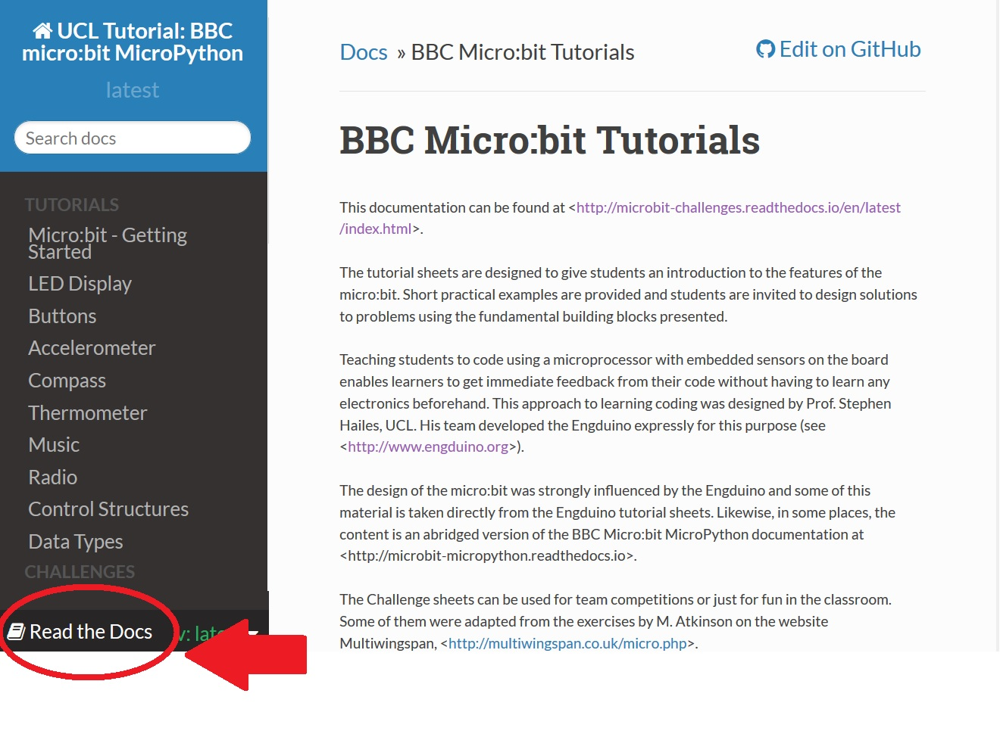

.. microbit_tutorials documentation master file, created by
   sphinx-quickstart on Sat Sep 10 20:23:45 2016.
   You can adapt this file completely to your liking, but it should at least
   contain the root `toctree` directive.

UCL's BBC Micro:bit Tutorials
=============================

This documentation can be found at <http://microbit-challenges.readthedocs.io/en/latest/index.html>.

The tutorial sheets are designed to give students an introduction to the features of the
micro:bit.  Short practical examples are provided and students are invited to design solutions to problems
using the fundamental building blocks presented.

Teaching students to code using a microprocessor with embedded sensors
on the board enables learners to get immediate feedback from their code without having to learn any electronics beforehand.  This approach to learning coding was designed by  Prof. Stephen Hailes, UCL. His team developed the `Engduino <http://www.engduino.org>`_ expressly for this purpose .  The design of the micro:bit was strongly influenced by the
Engduino and some of this material is taken directly from the Engduino tutorial sheets.
Likewise, in some places, the content is an abridged version of the
BBC Micro:bit MicroPython `documentation <http://microbit-micropython.readthedocs.io>`_.

The Challenge sheets can be used for team competitions or just for fun in the classroom.  Some of them were adapted from the
exercises by M. Atkinson on the website `Multiwingspan <http://multiwingspan.co.uk/micro.php>`_.

To download this documentation in pdf, epub or html format, click on the link at the bottom of the sidebar on the left:

If you would like to contribute to this resource, go ahead! Install git and create a branch. It would be great to have more challenges and some projects.

.. toctree::
   :maxdepth:1
   :caption: Tutorials

   tutorials/getting_started
   tutorials/images
   tutorials/buttons
   tutorials/accelerometer
   tutorials/compass
   tutorials/thermometer
   tutorials/music
   tutorials/radio
   tutorials/control
   tutorials/data_types

.. toctree::
   :maxdepth:1
   :caption: Challenges

   challenges/games/bop-it.rst
   challenges/games/consonant-or-vowel.rst
   challenges/games/obstacles.rst
   challenges/games/egg-basket.rst
   challenges/games/mouse-cheese.rst
   challenges/crypto/caesar.rst
   challenges/crypto/caesar_decrypt.rst  
   challenges/crypto/substitution.rst
   challenges/crypto/reverse_substitution.rst
   challenges/crypto/morse.rst		  
   challenges/sensors/spirit_level.rst
   challenges/sensors/theremin.rst
   challenges/sensors/radio.rst
   challenges/sensors/pingpong.rst
   challenges/sensors/rockpaperscissors.rst

.. * :ref:`genindex`
.. * :ref:`modindex`
.. * :ref:`search`
