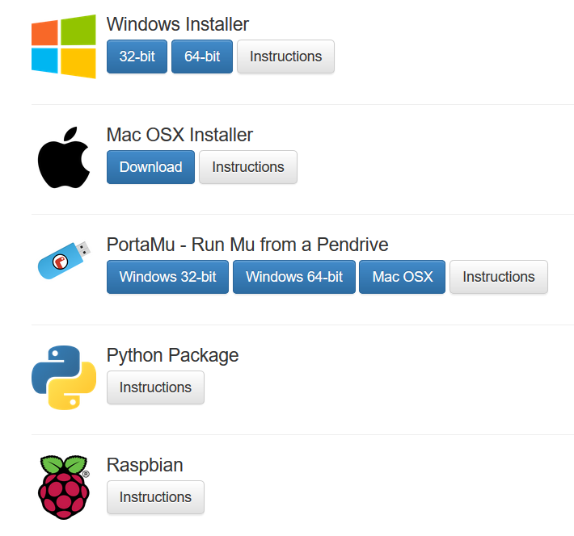

****************************
Setting Up Your Environment
****************************

Before you start coding, you will need a source code editor to be able to write, load and run programs on your micro:bit.
\There are four main options: 

    - In-browser `micro:bit editor`_ 
    - Beginner friendly `Mu editor`_ 
    - `MicroPython application`_ if you're on a ChromeBook  
    - Your regular Python editor with a suite of CLI commands (advanced)  

For the purposes of this tutorial we will be using the Mu editor, but feel free to use whatever suits you better.
To download Mu, go to Mu website.

.. _`micro:bit editor`: https://python.microbit.org
.. _`Mu editor`: https://codewith.mu/
.. _`MicroPython application` : https://chrome.google.com/webstore/detail/micropython/lhdjeebhcalhgnbigbngiaglmladclbo?hl=en-GB
.. _website: https://codewith.mu/en/

You can choose different options to install Mu. The ones you'll most likely use is an installer for your device (Mac/Windows), or installation through
Python package (pip) using :ref:`command line interface` if you've installed Python on your computer.

.. note:: For those that had worked with Python previously, MicroPython does not support regular Python external libraries, since many are too large for an embedded 
    device. However, a subset was recreated specifically for the `MicroPython ecosystem`_. 

.. _`MicroPython ecosystem`: https://docs.micropython.org/en/latest/library/index.html

Once the editor is installed, run it and plug micro:bit into your computer.
