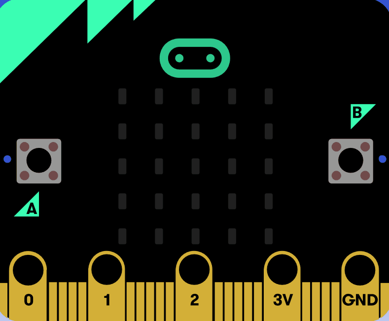
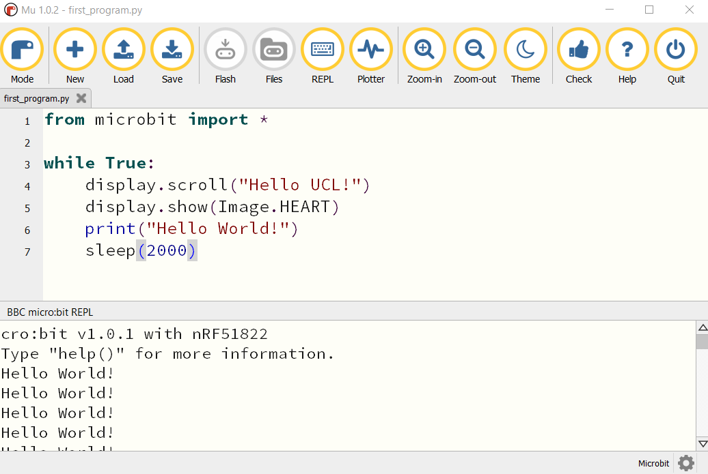

****************
First Program
****************

In general, the process of designing code is composed of these 4 steps. You can expect to go around the loop  quite a few times before you get your code working.

.. image:: assets/microbit_lifecycle.jpg
   :scale: 70%   
   :align: center

Design the Code
----------------

First of all you are going to write a program to display the message “Hello UCL!” followed by an image on the display of your micro:bit and print "Hi there" to Mu console. 
It's a good practice to think about what you want your code to do and how you're going to do it before you start writing. There's not much planning and design to do here,
but just so that you understand what a plan might look like::

    Repeat forever:
        Scroll "Hello UCL!" across the LED display
        Display a heart icon 
        Print "Hello World!" on a console
        Delay for 2 seconds

There are two ways to display the output of your code: you either use outputs available on the micro:bit (eg. the LEDs) or the REPL (Read Print Evaluate Loop) 
console available in the editor using the ``print`` statement. The console is especially useful for finding bugs (errors) in your code or trying out
new concepts or ideas.  

Let's go through this line-by-line::

    from microbit import *

Importing packages (like microbit) in Python makes us able to use functions or objects which are not defined in pure Python. In this case it's for example ``display`` or ``show``. ::     

	while True: 

This means do something (whatever follows this statement and is indented) while the condition following ``while`` is true. In this case, the condition is the keyword ``True``, 
means that this loop will go on forever - it's the same as writing (5 > 1), which evaluates to ``True`` in the end anyway.  
The rest of the program is straightforward::

	from microbit import *

	while True:
    	    display.show('Hello UCL!')
            display.show(Image.HEART)
	        print('Hello World!')    
    	    sleep(2000)
      
This displays ``Hello UCL!`` on the LED display and then shows the heart. 
The statement ``print('Hi There!!')``, will print the message in the REPL. Press the REPL button in the menu now to show the REPL window:

.. image:: assets/mu_repl_bar.png
   :scale: 70%
   :align: center

The REPL window shows us messages from the micro:bit and also allows us to send commands directly to the micro:bit. For now, we'll just be using the REPL 
to see messages that we print and error messages. 

Upload your program
--------------------

Now click on the Flash button in Mu and see what happens.

.. image:: assets/first_program.gif
   :scale: 70%
   :align: center 

The result on the micro:bit should look something like this:

Now try to open the REPL console:

Make a change 
-------------

The best way to learn what something is for is to try and change your code (and read the documentation, obviously).

                                    <\|°_°\|>

Are you wondering what the delay is for? Is it necessary? Try deleting it.
What happens if you replace ``True`` by ``False``?
What happens when you replace ``scroll`` by ``show``?

Now you have written your first program. Next sections will tell you more about writing more complex programms and about further uses of micro:bit.

.. seealso:: See the full micro:bit documentation_ for MicroPython.

.. _documentation: https://microbit-micropython.readthedocs.io/en/latest/tutorials/introduction.html 
