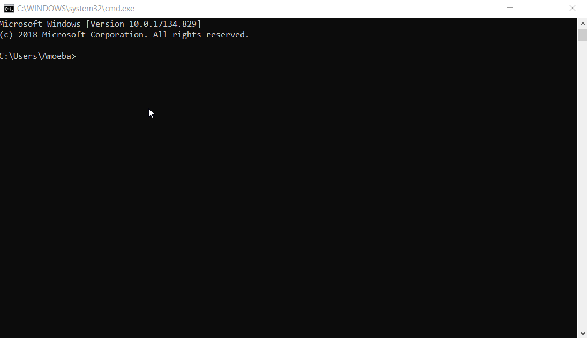

***********************
Command Line Interface
***********************

In the same way you use a graphical user interface (GUI) to interact with your computer using an arrow by clicking, it's possible to do the same using a command line 
interface (CLI) by issuing commands. You will be required to work using CLI from the beginning of your course, hence, it might be useful for you to become familiar with
it in advance. 

        
   Typing 'help' into Windows Command Prompt shows all the commands and what they do.

CLI used to be the usual way of interacting with programs and OS in the past, as it has much fewer system requirements. Now the majority of users use the GUI, while CLI 
has become a tool of the advanced users. Although it may look daunting and mysterious at the beginning, it's a very efficient tool for carrying out configuration and 
other tasks, since its functionality goes beyond that of a GUI.

The way you would use your OS CLI depends on your system, so it won't be covered in this tutorial. However, we encourage you to go and explore the basics (or advanced
concepts) on your own.

