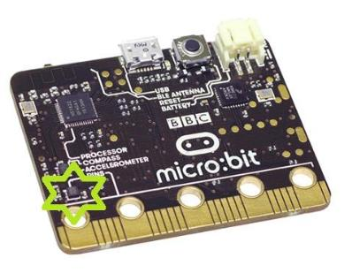

*****************
Accelerometer
*****************
The accelerometer on a BBC micro:bit measures acceleration, as its name suggests.
The accelerometer can measure accelerations of between +2g to -2g. 

The micro:bit measures movement along
three axes:

* X - tilting from left to right.
* Y - tilting forwards and backwards.
* Z - moving up and down.

.. image:: microbitAxes.jpg

Basic Functions
===============
The measurement for each axis is a positive or negative number
indicating a value in milli-g's. When the reading is 0 you are "level"
along that particular axis.  1024 milli-g
is the acceleration due to gravity.

You can access acceleration measurements one at a time or get all three
values at once and store them in a list.
Ask your teacher about lists later, but for now, just use the following code:: 

	from microbit import *

	while True:
	    x = accelerometer.get_x()
	    y = accelerometer.get_y()
	    z = accelerometer.get_z()
	    print("x, y, z:", x, y, z)
	    sleep(500)

Upload this and open the serial monitor. Hold the micro:bit flat with the
LEDs uppermost. You should see that the X and Y accelerations are near
to zero, and the Z acceleration is close to -1024. This tells you that
gravity is acting downwards relative to the micro:bit. Flip the board over
so the LEDs are nearest the floor. The Z value should become positive at
+1024 milli-g. If you shake the micro:bit vigorously enough, you’ll see that the
accelerations go up to ±2048 milli-g. That’s because this accelerometer is set
to measure a maximum of ±2048 milli-g: the true number might be higher than that.

If you've ever wondered how a mobile phone knows which up to show the images on
its screen, it's because it uses an accelerometer in exactly the same way as
the program above. Game controllers also contain accelerometers to help you
steer and move around in games.
	
Gestures
--------

The really interesting side-effect of having an accelerometer is gesture
detection. If you move your BBC micro:bit in a certain way (as a gesture) then
MicroPython is able to detect this.

MicroPython is able to recognise the following gestures: ``up``, ``down``,
``left``, ``right``, ``face up``, ``face down``, ``freefall``, ``3g``, ``6g``,
``8g``, ``shake``. Gestures are always represented as strings. While most of
the names should be obvious, the ``3g``, ``6g`` and ``8g`` gestures apply when
the device encounters these levels of g-force (like when an astronaut is
launched into space).

To get the current gesture use the ``accelerometer.current_gesture`` method.
Its result is going to be one of the named gestures listed above. For example,
this program will only make your device happy if it is face up::

    from microbit import *

    while True:
        gesture = accelerometer.current_gesture()
        if gesture == "face up":
            display.show(Image.HAPPY)
        else:
            display.show(Image.ANGRY)

Once again, because we want the device to react to changing circumstances we
use a ``while`` loop. Within the *scope* of the loop the current gesture is
read and put into ``gesture``. The ``if`` conditional checks if ``gesture`` is
equal to ``"face up"`` (Python uses ``==`` to test for equality, a single
equals sign ``=`` is used for assignment - just like how we assign the gesture
reading to the ``gesture`` object). If the gesture is equal to ``"face up"``
then use the display to show a happy face. Otherwise, the device is made to
look angry!

Advanced Functions
==================
There aren’t any for the accelerometer. But it's worth looking at how 
we can use the 3D acceleration to detect different kinds of motion like a 
being shaken. Acceleration is what
is known as a vector quantity (talk to your maths teacher) – it has a
magnitude (size, length) and a direction. To get the overall magnitude,
irrespective of orientation, we need to do a bit of maths. If we only
had X and Y axes (i.e. we had a 2D accelerometer) the situation would be:

.. image:: microbitOverallAcceleration.jpg
   :scale: 60 %
   :align: left

We can calculate the magnitude (length) of the resultant from Pythagoras' rule:

.. math::

   acceleration = \sqrt{x^2 + y^2}

BUT, we have a 3D accelerometer - and the same principle holds where we have 
X, Y and Z axes. So the overall magnitude of the resultant acceleration vector
is:

.. math::

   acceleration = \sqrt{x^2 + y^2 + z^2}

Here is the code to calculate the overall acceleration::

	from microbit import *
	import math

	while True:
	    x = accelerometer.get_x()
	    y = accelerometer.get_y()
	    z = accelerometer.get_z() 
	    acceleration = math.sqrt(x**2 + y**2 + z**2)
	    print("acceleration", acceleration)
	    sleep(500)

Now if you keep the the accelerometer still (put it on the desk), this
will give an acceleration of about 1g, irrespective of what orientation
you have the BBC micro:bit in – and it will be different to that as you
move it about. Actually, the value will vary slightly even if you
keep it still, because the accelerometer isn’t a perfect measuring
device. Dealing with this is a process called calibration and is something
we have to do when we need to know a quantity accurately.

Ideas for Projects with the Accelerometer
=========================================
* Using the BBC micro:bit music library, play a note based on the the reading from the accelerometer. Hint: set the pitch to the value of the accelerometer measurement.
* Display the characters 'L' or 'R' depending on whether the BBC micro:bit is tilted to the left or the right.
* Make the LEDs light up when the magnitude of the acceleration is greater than 1024 milli-gs.
* Shake the micro:bit to make the LEDs light up.
* Make a dice, hint: use one of the Python random functions. Type ``import random`` at the top of your program and use ``random.randrange(start, stop)``. This will generate a random number between ``start`` and ``stop`` - 1.
