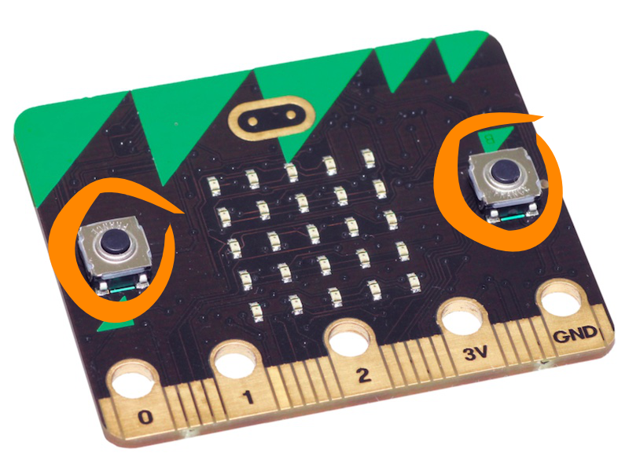

***********
Buttons 
***********

.. py:module:: microbit.button

The micro:bit has two buttons: ``A`` and ``B``.

You can use the buttons to get input from the user. Perhaps you'd like to start or stop your program with a button press 
or maybe you'd like to know how many times each button has been pressed. 

Basic Functions
================

Checking whether a button is pressed
------------------------------------

Sometimes we just want a program to wait until something happens, for example: we could ask the micro:bit to wait until, say, button 
``A`` is pressed and then print a message. We could do that like this: ::

	from microbit import *

	while True:
		if button_a.is_pressed():
			display.scroll("A")
		else:
			display.scroll(Image.ASLEEP)				

This means, if button ``A`` is pressed then display an ``A`` on the LED screen, otherwise, display ``Image.ASLEEP``. 

The problem with using ``is_pressed()`` is that unless you are pressing the button at that precise moment then you won't 
detect whether the button was ever pressed or not. It might be the case that the user pushes the button while the code is doing the something else, and the press is missed. 
The ``was_pressed()`` function is useful is you want to write code that occasionally checks whether the button has been pushed but then goes on to do something else. 
In this way you need never miss a button press again: ::

	from microbit import *

	while True:
	    if button_a.was_pressed(): 
	        display.scroll("A")
	    else:
		display.scroll(Image.ASLEEP)

	    sleep(1000)

What you’ll see is that the display will show an ``A`` for a second if you press the button, and then ``Image.ASLEEP`` is displayed. If you press the button while the 
program is delaying, then the ``A`` won’t show up immediately, but it will show up once the if statement test condition is executed. It becomes more apparent as you 
increase the delay.

Now try using ``button_a.isPressed()`` instead of ``button_a.was_pressed()``.

Counting the number of presses
------------------------------
To count the number of times a button was pressed, you can use the 
``get_presses()`` method.  Here is an example::

	from microbit import *

	while True:
	   sleep(3000)
	   count = button_a.get_presses()
	   display.scroll(str(count))	

The micro:bit will sleep for 3 seconds and then wake up and check how many times button ``A`` was pressed. The number of presses is 
stored in ``count``. 

Can you define your own ``get_presses`` function? 

Advanced Functions
===================

Checking for both buttons
-------------------------
It is possible to check a series of events by using conditional statements. Say you wanted to check whether button ``A`` was pressed or button ``B`` was pressed or 
whether both buttons were pressed at the same time: ::  

	from microbit import *

	while True:
	    if button_a.is_pressed() and button_b.is_pressed():
	        display.scroll("AB")
	        break
	    elif button_a.is_pressed():
	        display.scroll("A")
	    elif button_b.is_pressed():
	        display.scroll("B")
	    sleep(100)

The code above displays the letter corresponding to the button. If both buttons are pressed at the same time it displays ``AB``.

 
Practice questions
===================
* Change what is displayed when you press the button.
* Games that need user input.
