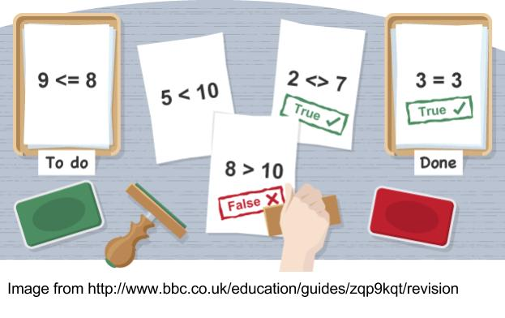
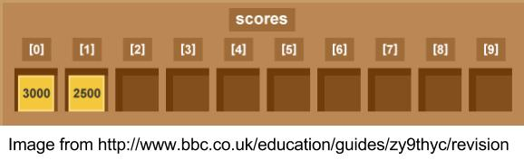

Data Types
==========

We will use values of different types in our micro:bit programs, for example: we could capture acceleration values from the accelerometer. Alternatively, we might want to count the number of button presses the user has made or to show a message to the user telling them the temperature of the room. In order to do these things we need to be able to describe the data we want to use. Python, and most other programming languages, recognise several data types including:

* Integers - these are whole numbers.
* Floats - these are numbers that contain decimal points or for fractions.
* Strings - these can contain a combination of any characters that we want to treat as text such as letters, numbers and symbols.  
* Boolean - used for True and False values.

In a simple program we might use all of these. Here are the data types we could use for a program storing information about our favourite micro:bit games:

.. figure:: dataTypes.png

   Image from: <http://www.bbc.co.uk/education/guides/zwmbgk7/revision/3>

Variables
---------

A variable can be thought of as a box that the computer can use to store a value. The value held in that box can change or ‘vary’.  All variables are made up of three parts: a name, a type and a value. In the figure below there are three variables of different types:

.. figure:: variable.jpg
   :scale: 60 %

   Image from: <https://developer.mozilla.org/en-US/docs/Learn/JavaScript/First_steps/Variables>

The variable ``name`` contains the string ``Bob``, the variable ``winner`` contains the value ``True`` and the variable ``score`` contains the value ``35``.

In Python we must give the variables we want to use a name and once we have done that we can start to use them, assigning and manipulating values::

	from microbit import *

	myCount = 0

	while True:
    	   if button_a.was_pressed(): 
		myCount = myCount + 1
	   sleep(2000)
	   print("Number of presses: " + str(count))

Here we have used the variable ``myCount`` to count the number of button presses for button ``A``.  Can you tell what else this snippet of code does?

Operations
----------

Numbers
^^^^^^^
You can use numeric values with the basic arithmetic operators: ``+,-,*,/`` in the same way as you would with a calculator. 
Let's look at an example using arithmetic operators. Imagine that you want to convert the temperature you read from the microbit in Celsius to Fahrenheit, you could use code like this::
	celsiusTemp = temperature()
	fahrenheitTemp = celsiusTemp * 9 / 5 + 32  

The special operator ``%``, called ``mod`` is used to calculate the remainder when one value is divided by another. For example: maybe you'd like to know whether a number is odd or even, you could try dividing it by 2, if it is even then there will be no remainder::

	theNumber = 3
	if theNumber % 2 == 1:
	   print("The number is odd")
	else:
	   print("The number is even")

If the remainder is equal to 1 then this program will print the message "The number is odd", otherwise. the program will print the message "The number is even". You might have written this program in a different way, This shows that people think about problems in different ways and not two programs are likely to be the same. 

Strings
^^^^^^^
The main thing to note about strings is that you can add them together, or concatenate them, with a ``+`` symbol. The code::

	name = "Hayley"

	message = "Well done " + name + ". You are a winner!"

Will concatenate the items on the right hand side of the ``=`` and put the result in the variable called ``message``.

You cannot join numbers and strings together; you must first convert the number to a string using the ``str()`` function if you want to do that::

	x = temperature
	if temperature < 6:
	   display.scroll("Cold" + str(temperature))

Comparisons
-----------

   Image from <http://www.bbc.co.uk/education/guides/zy9thyc/revision>

Often in programming we want to compare one value to another, a kind of test. We use these tests or comparisons in selection or loops. Here are some examples of comaparisons written in English::

	score is greater than 100
	name equals "Harry"
 	x acceleration is not equal to 0

Python has a set of comparison operators that allow us to write comparisons easily:

.. tabularcolumns:: |L|l|

+--------------------------------+----------------------------------------+
| **Comparison Operator**        | **Meaning**                            |
+================================+========================================+
| ==                             | Equal to                               |
+--------------------------------+----------------------------------------+
| <, <=                          | Less than, less than or equal to       |
+--------------------------------+----------------------------------------+
| >, >=                          | Greater than, greater than or equal to |
+--------------------------------+----------------------------------------+
| !=                             | not equal to                           |
+--------------------------------+----------------------------------------+

Rewriting the comparisons above in Python would be::

	score > 100
	name ==  "Harry"
 	acceleration  != 0

Using Comparisons
^^^^^^^^^^^^^^^^^

The result of a comparison is either ``True`` or ``False``. ``True`` and ``False`` are special values known as **Boolean values**  and we can use can use them to determine what our programs will do. You may have already used some examples that do this. In this example, the micro:bit will show an arrow pointing in the direction
of the tilt in the x axis:: 

	from microbit import *
	
	while True:
	
	    x_acceleration = accelerometer.get_x()
	
	    if x_acceleration > 100:
	         display.show(Image.ARROW_E)
	
	    if  x_acceleration < 100:
	         display.show(Image.ARROW_W) 

Lists
-----

 
   Image from <http://www.bbc.co.uk/education/guides/zy9thyc/revision>

Lists are useful for storing several values together. Let's say we want to store a player's scores, we could use a list like the one pictured above. The list has one box for each value. The cells or boxes are known as `elelments`. 

Let's see how to use a list in Python. To create a list we can tell Python the name  of the list and what it will contain:: 

	from microbit import *

	highScores = [25, 20, 10, 15, 30]       # Create a list and store some values in it.
	print(highScores[0])			# Print 25
	print(highScores[3])			# Print 15

Finding the value of one of the elements in a list is easy as long as you remember that Python counts the elements from '0'. In our ``highScores`` list above, ``highScores[0]`` is 25 and ``highScores[3]`` is 15.

Not surprisingly, Python has some features to help us do things with lists. The code snippet below will go through the array elements one by one so that we can sum them and calculate the average high score::

	print("Average High Score: ") 		

	total = 0
	for score in highScores: 		# For each element ...
		total = total + score

	average = total / len(highScores)  # Use the len() function here to find the length of the array 
	print(average)  

Add to a List
^^^^^^^^^^^^^
There will be times when we don't know how large to make an array in advance or what the values in the list are going to be. You might want to fill a list with
temperature readings or accelerometer values, for example.  This code illustrates how you can do that:: 

	from microbit import *

	recordedTemperature = [] 		# Create an empty list
	for i in range(100):			# Add 100 temperature values
		recordedTemperature.append(temperature())
		sleep(1000)			 

The ``for`` loop is executed 100 times and ``i`` will have values from 0 to 99. This will measure the temperature every second for 100 seconds and append the value on to the end of the list. 

Delete from a List
^^^^^^^^^^^^^^^^^^
There are two ways to delete elements from lists that are helpful, you might want to delete an element with a particular value from a list::

	highScores.delete(24)

This will delete the first element with the value 24.
Alternatively, you might want to delete an element at a specific position, if you know it:: 
 
	highScores.pop(3)

This will delete or 'pop' the element at the given position in the list. Note that::

	highScores.pop() 
will delete the last element in the list.
