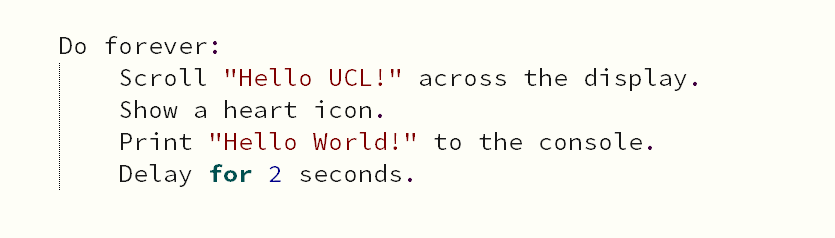
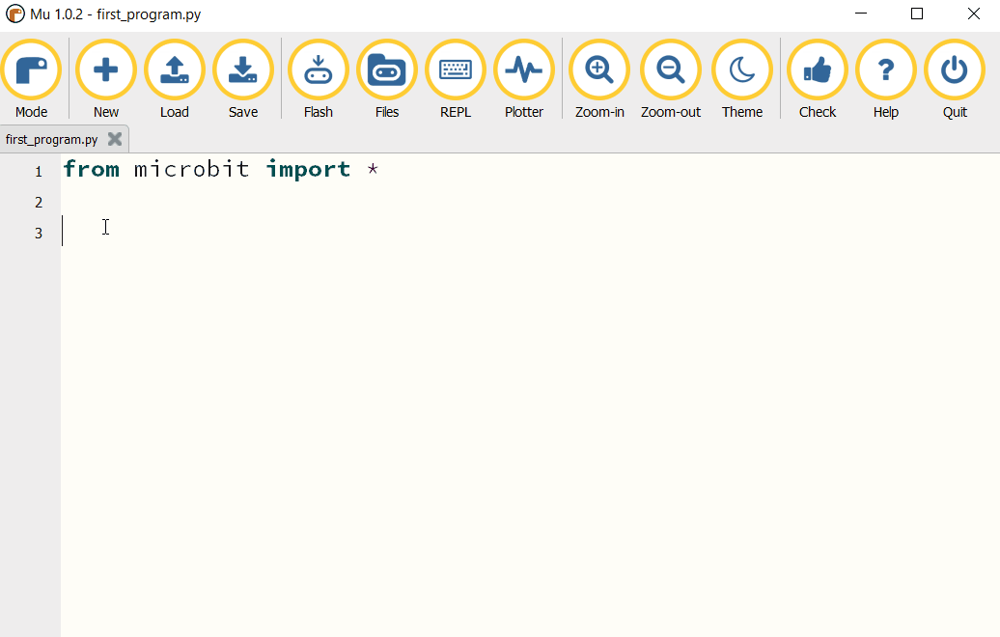

****************************
Micro:bit - Getting Started 
****************************

The BBC micro:bit is a programmable micro-computer - microcontroller - that can be used to create all kinds of projects from robots to musical instruments – 
the possibilities are endless. Let's take a look at the features that you can use in your designs:

 * 25 red LED lights that can flash messages.
 * Two programmable buttons (A and B) that can be used to tell the micro:bit when to start and stop things.
 * A thermistor to measure the temperature.
 * A light sensor to measure the change in light.
 * An accelerometer to detect motion.
 * A magnetometer to tell you which direction you’re heading in.
 * A radio and a Bluetooth Low Energy connection to interact with other devices.

.. image:: assets/microbit-hardware-access.jpg
   :scale: 40%
   :align: center
   
Source: https://microbit.org/guide/features/

You can program micro:bit using several languages: MicroPython, C++ or JavaScript. This tutorial will focus on programming micro:bit using
MicroPython, but if you already are familiar with Python, or you're looking for extra challenge, look at the section with other languages_. C/C++ might be 
useful in particular, as it's the main language used to program embedded devices.

.. _languages: https://microbit.org/code/

MicroPython is a version of Python_ , that's designed to run on microcontrollers like micro:bit. Programming in Python is basically 
writing a series of steps to be executed (it's an *imperative* language), as you will see below when writing your first program.  

.. _Python: https://www.python.org/

Setting Up Your Environment
===========================

Before you start coding, you will need a source-code editor to be able to write, load and run programs on your micro:bit.
There are several possibilities, but for ease of use we are using Mu editor in this tutorial, which you can download here_.

.. _here: https://codewith.mu/en/

Once you have the editor installed, run it and plug micro:bit into your computer.

Your First Program
===================
In general, the process of designing code is composed of these 4 steps. You can expect to go around the loop  quite a few times before you get your code working.

.. image:: assets/microbit_lifecycle.jpg
   :scale: 70%   
   :align: center

Design the Code
----------------

First of all you are going to write a program to display the message “Hello UCL!” followed by an image on the display of your micro:bit and print "Hi there" to Mu console. 
It's a good practice to think about what you want your code to do and how you're going to do it before you start writing. There's not much planning and design to do here,
but just so that you understand what a plan might look like:

There are two ways to display the output of your code: you either use outputs available on the micro:bit (eg. the LEDs) or the REPL (Read Print Evaluate Loop) 
console available in the editor using the ``print`` statement. The console is especially useful for finding bugs (errors) in your code or trying out
new concepts or ideas.  

Let's go through this line-by-line::

    from microbit import *

Importing packages (like microbit) in Python makes us able to use functions or objects which are not defined in pure Python. In this case it's for example ``display`` or ``show``. ::     

	while True: 

This means do something (whatever follows this statement and is indented) while the condition following ``while`` is true. In this case, the condition is the keyword ``True``, 
means that this loop will go on forever - it's the same as writing (5 > 1), which evaluates to ``True`` in the end anyway.  
The rest of the program is straightforward::

	from microbit import *

	while True:
    	    display.show('Hello UCL!')
            display.show(Image.HEART)
	        print('Hello World!')    
    	    sleep(2000)
      
This displays ``Hello UCL!`` on the LED display and then shows the heart. 
The statement ``print('Hi There!!')``, will print the message in the REPL. Press the REPL button in the menu now to show the REPL window:

.. image:: assets/mu_repl_button.jpg
   :scale: 60%
   :align: center

The REPL window shows us messages from the micro:bit and also allows us to send commands directly to the micro:bit. For now, we'll just be using the REPL 
to see messages that we print and error messages. 

Upload your program
--------------------

Now click on the Flash button in Mu and see what happens.

The result on the micro:bit should look something like this:

.. image:: assets/example_program.gif
   :scale: 40% 
   :align: center

Now try to open the REPL console:

.. image:: assets/first_program_console.png 

Make a change 
-------------

The best way to learn what something is for is to try and change your code (and read the documentation, obviously).

Are you wondering what the delay is for? Is it necessary? Try deleting it.
What happens if you replace ``True`` by ``False``?
What happens when you replace ``scroll`` by ``show``?

Now you have written your first program. Carry on and see what else you can do with the micro:bit <\|°_°\|>.

.. note:: If you feel confused or if you feel like you need more guidance to start programming, don't feel discouraged! There is a lot of free online courses that are great at going through basics of programming with Python, like this one_. Try to go through a first few lessons, and everything will make more sense!

.. _one: https://www.edx.org/course/introduction-to-computer-science-and-programming-using-python-2 

.. seealso:: See the full micro:bit documentation_ for MicroPython.

.. _documentation: https://microbit-micropython.readthedocs.io/en/latest/tutorials/introduction.html 

Programming micro:bit with other laguages
==========================================

As mentioned above, micro:bit can also be programmed using JavaScript and C/C++. 

JavaScript
-----------

Online editor and documentation for JavaScript can be found on micro:bit's page_.

.. _page: https://makecode.microbit.org/#

C/C++
----

Micro:bit is programmable using Mbed online compiler. You can watch their getting started video_ for a basic set up. 

.. _video: https://os.mbed.com/platforms/Microbit/#getting-started-video
.. _documentation: