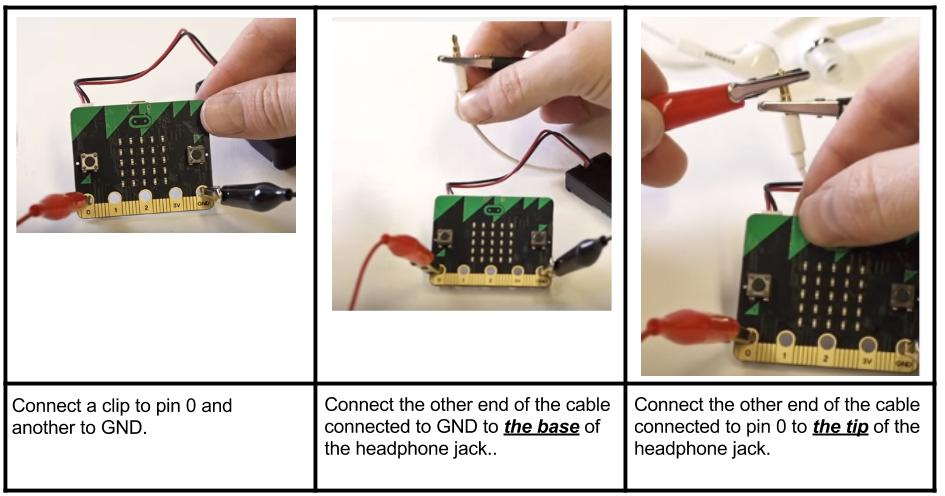

****************
Music
****************
This is a quick guide to some of the things you can do with micro:bit music. The idea is that you can use this information to experiment and 
create something for yourselves.  You can use the micro:bit to play simple tunes, provided that you connect a speaker to your board. 

If you are using a speaker, you can connect your micro:bit using crocodile clips like this: 

.. figure:: connect_speaker.jpg
   :scale: 150 %

   Image from: <https://www.kitronik.co.uk/blog/microbit-alarm-kitronik-university/>

.. warning:: You cannot control the volume of the sound level from the micro:bit. Please be very careful if you are using headphones. A speaker is a better choice for work with sound.

If you are using headphones you can use crocodile clips to connect your micro:bit to some headphones like this: 

Basic Functions
================

Play a tune
-----------
Let's play some music::

	from microbit import *
	import music

	music.play(music.NYAN)

.. note:: You must import the ``music`` module to play and control sound.

MicroPython has quite a lot of built-in melodies. Here's some of them, try them out: 

 *  ``music.DADADADUM``
 *  ``music.ENTERTAINER``
 *  ``music.PRELUDE``
 *  ``music.ODE``
 *  ``music.NYAN``
 * ``music.RINGTONE``
 
 
Make your own tune
-------------------
You can write your own tune, here is a snippet of code showing how to play a sound. The number after the 
note is the octave and an octave can be a number from 1 to 8. The number after the colon says how long the note will
last::
	from microbit import *
	import music

	# Play a 'C'
	music.play('C')

	# Play a 'C' for 4 beats long
	music.play('C:4')

	# Play a 'C' in octave number 3 for 4 beats long
	music.play('C3:4')

Playing a series of notes one after the other is easy, you just put the notes you want to play in a list::

	from microbit import *
	import music

	# Tune: Frere Jacques
	tune = ["C4:4", "D4:4", "E4:4", "C4:4", "C4:4", "D4:4", "E4:4", "C4:4",
        	"E4:4", "F4:4", "G4:8", "E4:4", "F4:4", "G4:8"]
	music.play(tune)
	

Advanced Functions
===================
You can also specify the note you want to play as a ``frequency``. Take a look at this example where we make a police siren. The clever thing here is that the
frequency or note is controlled by a ``for`` loop::

	while True:
		for freq in range(880, 1760, 16):
		        music.pitch(freq, 6)
		for freq in range(1760, 880, -16):
			music.pitch(freq, 6)
	 
Can you guess what this does? Each time around the loop a new frequency is calculated by adding (or subtracting) 16. 

Ideas for Projects with Music 
==============================
* Make up your own tune.
* Make a musical instrument. Change the pitch of the sound played based on the readings from the accelerometer.  
