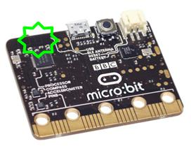

******
Radio
******
Your micro:bit has a radio chip that can be used to transmit and receive
messages.

Basic Functions
================

Getting ready 
-------------
Before you can use the radio you must remember to ``import`` the radio library and to turn the radio on on.  Once the radio is on it will hear the messages from any other micro:bit that is within range:: 

	from microbit import *
	import radio		

	radio.on()			# Switch the radio on.

Setting a channel number
^^^^^^^^^^^^^^^^^^^^^^^^
If you only want share messages within a group of devices then each micro:bit in the group must be configured to share the same channel number. The channel number must be a number between ``0`` and ``100``. You can do that like this::

	radio.config(channel=19)	# Set the channel number to 19 

It is important to do this if you are in a room with other people using their micro:bits because otherwise your micro:bit will overhear all the messages nearby and that is not what you want generally. 

Setting the power level
^^^^^^^^^^^^^^^^^^^^^^^
Finally, you should set the power level for the radio, by default, your micro:bit will be transmitting on power level 0 which means that your messages might not get transmitted very far. The power level can be a value between ``0`` and ``7``::

	radio.config(power=7)	# Set the power level to 7 

Sending and receiving a message
-------------------------------
Now you are ready to send or receive a message. You can send a string which is 
up to 250 characters in length in the message. Here is an
example::

	my_message = "Be nice to yu turkeys dis christmas, Cos' turkeys just wanna hav fun, Turkeys are cool, turkeys are wicked, An every turkey has a Mum."

	radio.send(my_message)

Receiving a message is similar in nature, just use::

    message_received = radio.receive()

Putting it together
-------------------
Your micro:bit is smart, it can send and receive messages in quick succession. Just tell the micro:bit to keep checking for messages or sending them like this::

	from microbit import * 
	import radio

	radio.on()
	radio.config(channel=19)	# Choose your own channel number
	radio.config(power=7)		# Turn the signal up to full strength 

	my_message = "Be nice to yu turkeys dis christmas, Cos' turkeys just wanna hav fun, Turkeys are cool, turkeys are wicked, An every turkey has a Mum."
	
	# Event loop.
	while True:
		radio.send(my_message) 
		incoming = radio.receive()
		if incoming is not None:
		    display.show(incoming)
		    print(incoming)
		sleep(500)

If you print the incoming message, you will see that sometimes it contains the value ``None``. That is because sometimes the micro:bit checks for a message but nothing has arrived. We can ignore these non-events by checking whether ``incoming`` equals ``None`` and ignoring it if that is the case.

Ideas for Projects with the Radio
=================================
* Send a message every time button ``A`` is pressed.
* You will need a pair of micro:bits. Program one micro:bit to receive messages and print the message received using the ``print()`` method. eave this micro:bit plugged into your computer with a USB cable. Program the other micro:bit to send accelerometer readings or the temperature readings in messages every second. Unplug this micro:bit and use a battery pack to power it. Congratulations! you have created a data logger!   
