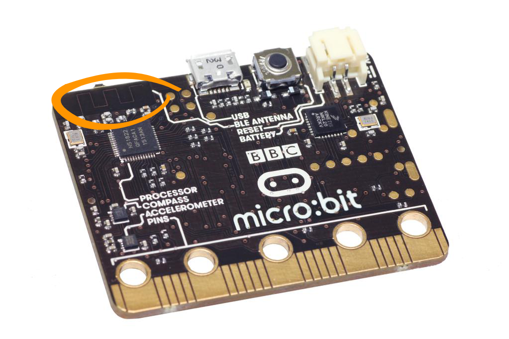

******
Radio
******
Micro:bit has a Bluetooth Lowe Energy (BLE) antenna that can be used to transmit and receive messages.

Basic Functions
================

Getting ready 
-------------
Before you can use the radio you must remember to import the ``radio`` module and to turn the radio on.  Once the radio is on, it will be able to receive messages from 
any other micro:bit within range: :: 

	from microbit import *
	import radio		

	radio.on()			

Setting a channel number
^^^^^^^^^^^^^^^^^^^^^^^^
If you only want share messages within a group of devices then each micro:bit in the group must be configured to share the same channel number. The channel number must 
be a number between ``0`` and ``100``: ::

	# Set the channel number to 19
	radio.config(channel=19)	 

It is important to do this if you are in a room with other people using their micro:bits because otherwise your micro:bit will overhear all the messages nearby and that 
is not what you usually want. 

Setting the power level
^^^^^^^^^^^^^^^^^^^^^^^
Finally, you should set the power level for the radio. By default, your micro:bit will be transmitting on power level 0 which means that your messages won't get 
transmitted very far. The power level can be a value between ``0`` and ``7``::

	# Set the power level to 7
	radio.config(power=7)	

Sending and receiving a message
-------------------------------
Now you are ready to send or receive a message. You can send a string which is up to 250 characters in length in the message: ::

	message_to_master = "Ash nazg durbatulûk, ash nazg gimbatul, ash nazg thrakatulûk, agh burzum-ishi krimpatul."

	radio.send(message_to_master)

Receiving a message: ::

    message_received = radio.receive()

Putting it together
-------------------
::

	from microbit import * 
	import radio

	radio.on()
	radio.config(channel=19)	# Choose your own channel number
	radio.config(power=7)		# Turn the signal up to full strength 

	message_to_master = "Ash nazg durbatulûk, ash nazg gimbatul, ash nazg thrakatulûk, agh burzum-ishi krimpatul."
	
	# Event loop.
	while True:
		radio.send(message_to_master) 
		incoming = radio.receive()
		if incoming is not None:
		    display.show(incoming)
		    print(incoming)
		sleep(500)

If you print the incoming message, you will see that sometimes it contains the value ``None``. That is because sometimes the micro:bit checks for a message but nothing 
has arrived. We can ignore these non-events by checking whether ``incoming`` equals ``None`` and ignoring it if that is the case.

Interfacing With Your Phone
----------------------------

Using the microbit Bluetooth antenna, it's possible to connect your micro:bit to your phone and interact with micro:bit wirelessly. However, MicroPython does not support
this capability due to lack of RAM capacity. 

Practice questions
====================
* Send a message every time button ``A`` is pressed.
* You will need a pair of micro:bits. Program one micro:bit to receive messages and print the message received using the ``print()`` method. Leave this micro:bit plugged into your computer with a USB cable. Program the other micro:bit to send accelerometer readings or the temperature readings in messages every second. Unplug this micro:bit and use a battery pack to power it. Congratulations! you have created a data logger!   
