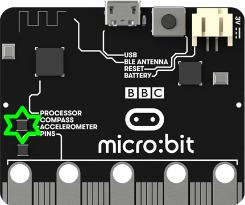

***********************
The Name for the sensor
***********************
High level description of the sensor and picture if necessary, for example:

Basic Functions
================
Describe the basic functions.

Advanced Functions
================
Describe the more advanced functions if there are any.

Ideas for Projects with the Compass
===================================
* List projects that students can make with the micro:bit. 
