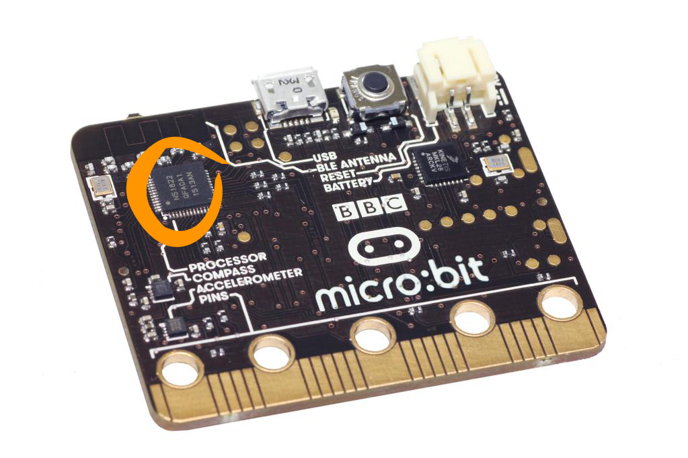

***************
Thermometer
***************
.. py:module:: microbit

The thermometer on the micro:bit is embedded in one of the chips – and chips get warm when powered up. Consequently, it doesn’t measure room temperature very
accurately. The chip that is used to measure temperature can be found on the left hand side of the back of the micro:bit:

Basic Functions
================
There is only one basic function for the thermometer – to get the temperature, which is returned as an integer in degrees Celsius:: 

   from microbit import *
   
   while True:
      temp = temperature()
      display.scroll(str(temp) + 'C')
      sleep(500)

The temperature the thermometer measures will typically be higher than the true temperature because it’s getting heated from both the room and the electronics on the board. 
If we know that the temperature is 27°C but the micro:bit is consistently reporting temperatures that are, say, 3 degrees higher, then we can correct the reading. 
To do this accurately, you need to know the real temperature without using the micro:bit. Can you find a way to do that?

Practice questions
===================
* Try calibrating the thermometer. Does it still give the right temperature when you move it to a warmer or cooler place?
* Make the LEDs change pattern as temperature changes
* Find out how much the temperature changes in a room when you open a window – what do you think that tells you about heating energy wasted?
